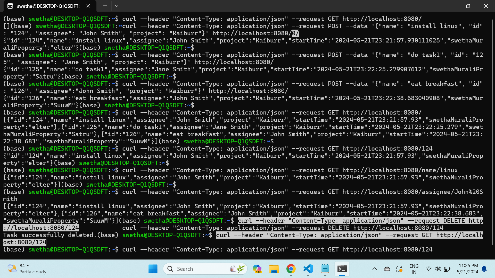

# kaiburr-assessment-task1

## Instructions

1. Clone the repository. 
2. Navigate to target/classes and create a file application.properties with the MongoDB connection details.
3. Navigate to src/main/java/com/kaiburrassessment/task1 and run Application.java.
4. Send requests to localhost:8080.

## Screenshot

